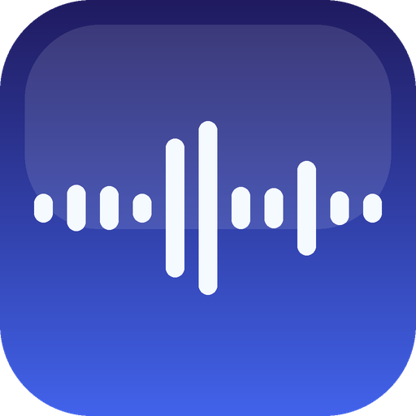

<div align="center">



# voiceBox

**Clone any voice. Read anything. All on your Mac.**

Local voice cloning · long-form reading · zero cloud · native Apple Silicon

**English** · [中文](README.zh-Hans.md) · [日本語](README.ja.md)

[](https://github.com/caspianchan31/voiceBox/releases/latest)
[](https://www.apple.com/macos/)
[](https://en.wikipedia.org/wiki/Apple_silicon)

</div>

---

## TL;DR

> Drop in 5 seconds of reference audio, clone any Mandarin or English voice locally, and read your entire script aloud — without sending a single byte to the cloud.

---

## ✨ What it does

- 🎙 **Voice clone** from a 5–15 sec sample, auto-transcribed
- 📝 **Long-form synthesis** with automatic segmentation and streaming playback
- 🎧 **Export** to WAV / M4A / MP3 with ⌘S
- 📚 **Persistent voice library** across launches
- 🕘 **Generation history** — every synthesis saved, replay & re-export
- 🛡 **100% local** — on-device inference, no network requests

---

## 📦 Download

**[⬇️ Download the latest release](https://github.com/caspianchan31/voiceBox/releases/latest)**

Or browse the [Releases page](https://github.com/caspianchan31/voiceBox/releases) for older versions.

---

## 🚀 Install

1. Download `voiceBox-X.Y.Z.dmg` and double-click to mount
2. Drag `voiceBox.app` into your `Applications` folder
3. **First launch:** right-click (or Control-click) `voiceBox.app` in Applications → choose **Open** → click **Open** again in the dialog
4. Subsequent launches: just double-click

> The app isn't notarized, so the first launch needs the right-click → Open step — a one-time macOS step for non-notarized apps, not a problem with voiceBox.
> If you see a "damaged" warning, run in Terminal: `xattr -dr com.apple.quarantine /Applications/voiceBox.app`

---

## 🎬 Workflow

```
   ┌──────────────┐      ┌──────────────┐      ┌──────────────┐
   │ Reference    │      │  Your        │      │  Cloned      │
   │  Audio (5s)  │  +   │   Script     │  →   │   Speech     │
   │  + ASR text  │      │  (any len)   │      │  WAV/M4A/MP3 │
   └──────────────┘      └──────────────┘      └──────────────┘
       (one click ✨)         (paste / drop)         (⌘S export)
```

**3 steps:**

1. **Studio** tab → click the voice chip → **Add voice** → drop in reference audio → click ✨ to auto-transcribe → save
2. **Studio** main input → paste your script (or drop a `.txt`) → pick a voice
3. ⌘↩ to generate · listen · ⌘S to export

---

## 🧠 Under the Hood

| Purpose | Engine | Source |
|---|---|---|
| Speech synthesis (TTS) | Qwen3 voice engine | Alibaba Qwen |
| Speech recognition (ASR) | Qwen3 voice recognition | Alibaba Qwen |
| On-device acceleration | Apple Silicon (GPU / Neural Engine) | Apple |

On first launch the voice models (~4 GB total) are downloaded — use a stable connection. After that, everything runs offline.

---

## ❓ FAQ

<details>
<summary><b>Is voiceBox open source?</b></summary>

The binary releases are free for personal use. The source code is **not** publicly available. voiceBox builds on open-source models and frameworks, credited below.

</details>

<details>
<summary><b>Will my voice or text be uploaded?</b></summary>

No. All speech computation runs locally on your Mac's GPU / Neural Engine, fully offline. The only network request is on first launch, to download the voice models. After that you can use it with no connection at all.

</details>

<details>
<summary><b>Which languages are supported?</b></summary>

Mandarin Chinese and English work best. The Qwen3 voice engine also officially supports Spanish, French, German, Japanese, Portuguese, Italian and others — ten languages in total.

</details>

<details>
<summary><b>Why isn't it on the Mac App Store?</b></summary>

App Store sandboxing breaks the local file-system access we need for reference audio and exports. Direct distribution gives a cleaner experience.

</details>

<details>
<summary><b>Can I use it commercially?</b></summary>

The app itself is free, but commercial licensing of the underlying Qwen3 models follows each model's own license. voiceBox takes no responsibility for compliance of the generated output.

</details>

---

## 📋 Requirements

- macOS 15+ (Sequoia or newer)
- Apple Silicon (M1 / M2 / M3 / M4)
- At least 5 GB of free disk space (model weights)
- Internet (first-time model download only)

---

## 🗺 Roadmap

- [ ] App notarization + auto-update (Sparkle)
- [ ] Batch generation across voices
- [ ] Synchronized subtitle (SRT) export
- [ ] Custom pause / emphasis markers
- [ ] iOS version

---

## 🙏 Acknowledgements

voiceBox wouldn't exist without these projects:

- [**MLX**](https://github.com/ml-explore/mlx) by Apple — the framework
- [**mlx-audio-swift**](https://github.com/Blaizzy/mlx-audio-swift) by Prince Canuma — the Swift TTS/STT layer
- [**mlx-audio**](https://github.com/Blaizzy/mlx-audio) by Prince Canuma — the Python research playground
- [**Qwen**](https://github.com/QwenLM) by Alibaba — TTS & ASR models
- [**Hugging Face**](https://huggingface.co/) — model distribution

---

## 📮 Feedback

Found a bug / want a feature? Open an [Issue](https://github.com/caspianchan31/voiceBox/issues).

---

<div align="center">

Made with ☕ on Apple Silicon.

</div>
